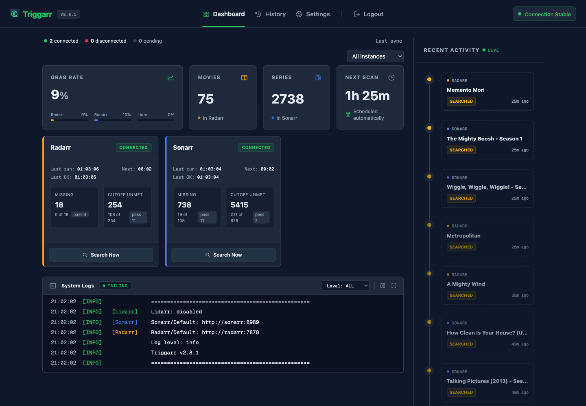
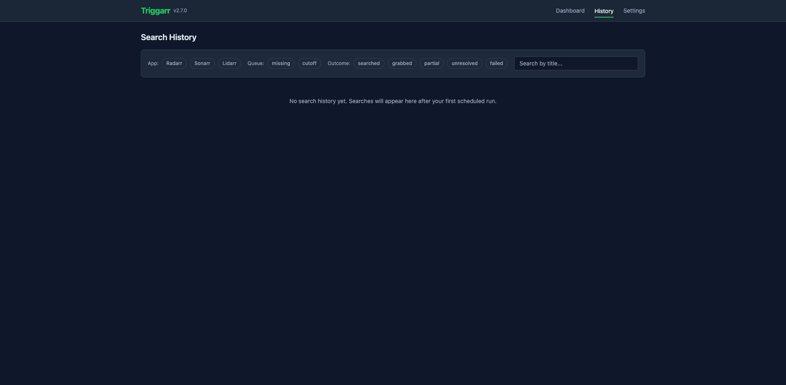
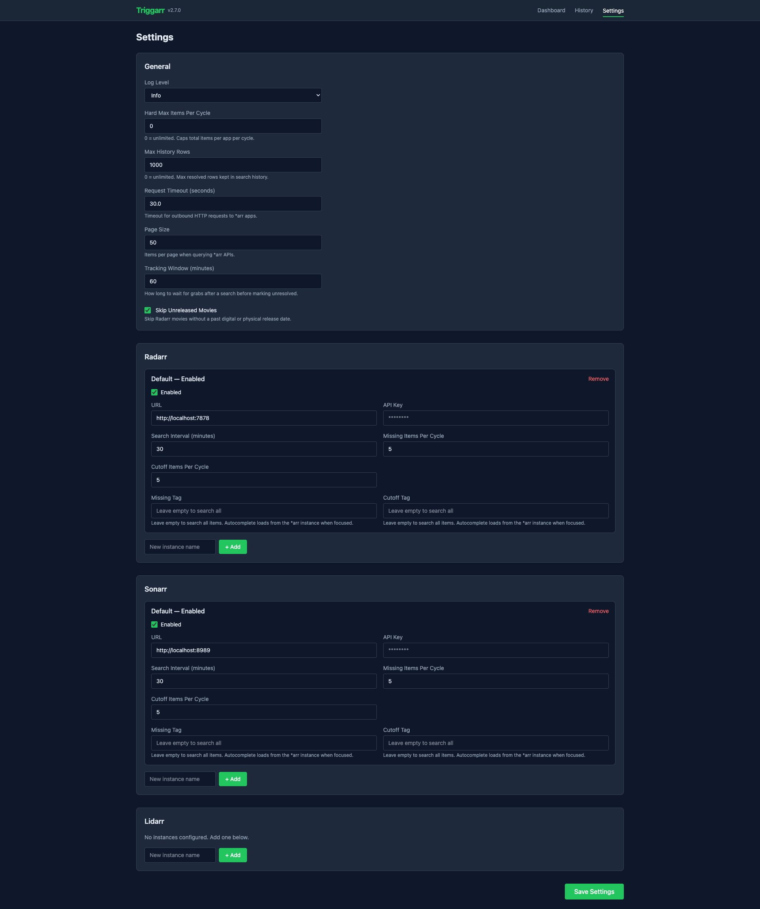

# Triggarr

[](https://github.com/thejuran/triggarr/actions/workflows/ci.yml)
[](https://ghcr.io/thejuran/triggarr)

Python automation daemon that triggers searches in Radarr and Sonarr on a schedule.

Radarr and Sonarr don't auto-search for missing and upgrade-eligible media on a timer. Triggarr does -- set a schedule, walk away.

## Table of Contents

- [Features](#features)
- [Screenshots](#screenshots)
- [Install](#install)
- [Configuration Reference](#configuration-reference)
- [Security Model](#security-model)
- [Development](#development)

## Features

- Scheduled searches for missing and upgrade-eligible media
- Web dashboard with real-time connection status and search history
- Browser-based config editor -- no manual TOML editing needed
- Hard max limit to cap searches per cycle (safety ceiling)
- Persistent SQLite search history (survives restarts)
- Docker-first with PUID/PGID support, or standalone pip install

## Screenshots







## Install

### Docker (recommended)

```yaml
# docker-compose.yml
services:
  triggarr:
    image: ghcr.io/thejuran/triggarr:latest
    container_name: triggarr
    environment:
      - PUID=1000    # Your user ID (run `id -u` to find)
      - PGID=1000    # Your group ID (run `id -g` to find)
    volumes:
      - triggarr_config:/config
    ports:
      - "127.0.0.1:6868:6868"  # Localhost only -- use Tailscale or reverse proxy for remote access
    cap_drop:
      - ALL
    cap_add:
      - CHOWN
      - DAC_OVERRIDE
      - FOWNER
      - SETUID
      - SETGID
    restart: unless-stopped

volumes:
  triggarr_config:
```

Run `docker compose up -d`, then visit [http://localhost:6868](http://localhost:6868) to configure your Radarr/Sonarr connection.

On first run, a default config file is auto-generated at `/config/triggarr.toml`. Use the web UI to configure -- no need to edit the file by hand.

### Standalone (pip)

Requires Python 3.11+. Download the `.whl` from the [latest release](https://github.com/thejuran/triggarr/releases/latest), or install directly:

```bash
pip install https://github.com/thejuran/triggarr/releases/latest/download/triggarr-2.4.0-py3-none-any.whl
```

Set the config directory and run:

```bash
export TRIGGARR_CONFIG_DIR="$HOME/.config/triggarr"
mkdir -p "$TRIGGARR_CONFIG_DIR"
triggarr
```

Visit [http://localhost:6868](http://localhost:6868) to configure. Config and data files are stored in `TRIGGARR_CONFIG_DIR`.

To run in the background, use a process manager like systemd, launchd, or supervisor. A minimal systemd unit:

```ini
# /etc/systemd/system/triggarr.service
[Unit]
Description=Triggarr
After=network.target

[Service]
Type=simple
User=triggarr
Environment=TRIGGARR_CONFIG_DIR=/var/lib/triggarr
ExecStart=/usr/local/bin/triggarr
Restart=on-failure
RestartSec=10

[Install]
WantedBy=multi-user.target
```

## Configuration Reference

All settings live in `/config/triggarr.toml`. You can also edit everything from the web UI at [http://localhost:6868/settings](http://localhost:6868/settings) -- changes are written to the TOML file and take effect immediately without restart.

```toml
# Triggarr Configuration

[general]
# Log level: debug, info, warning, error
log_level = "info"                  # default: "info"

# Hard max items searched per app per cycle. 0 = unlimited.
# When set, the limit is split proportionally between missing and cutoff searches.
hard_max_per_cycle = 0              # default: 0 (unlimited), valid: 0+

[radarr]
# Radarr connection settings
url = "http://radarr:7878"          # Radarr base URL (string, required if enabled)
api_key = "your-api-key-here"       # From Radarr > Settings > General > API Key
enabled = false                     # default: false -- set to true to activate

search_interval = 30                # default: 30 (minutes between search cycles)
search_missing_count = 5            # default: 5 (missing items to search per cycle)
search_cutoff_count = 5             # default: 5 (cutoff/upgrade items to search per cycle)

[sonarr]
# Sonarr connection settings
url = "http://sonarr:8989"          # Sonarr base URL (string, required if enabled)
api_key = "your-api-key-here"       # From Sonarr > Settings > General > API Key
enabled = false                     # default: false -- set to true to activate

search_interval = 30                # default: 30 (minutes between search cycles)
search_missing_count = 5            # default: 5 (missing items to search per cycle)
search_cutoff_count = 5             # default: 5 (cutoff/upgrade items to search per cycle)
```

Environment variable overrides are supported via pydantic-settings (e.g., `TRIGGARR_GENERAL__LOG_LEVEL=debug`), but TOML is the primary configuration method.

## Security Model

Triggarr has **no authentication**. This is intentional.

### Design philosophy

Triggarr is designed to run on a trusted local network -- behind Tailscale, a VPN, or bound to localhost. No passwords means no credential attack surface.

### What IS protected

- **API keys** are never exposed in HTTP responses or HTML (`SecretStr` discipline throughout)
- **Log output** redacts all configured secrets automatically
- **Config file** written with `0600` permissions (owner-read/write only)
- **Docker container** drops all capabilities except CHOWN, DAC_OVERRIDE, FOWNER, SETUID, SETGID
- **CSRF protection** via Origin header checking on POST requests
- **URL validation** blocks SSRF attempts (non-HTTP schemes, inappropriate public IPs)
- **Security hardening** via `no-new-privileges` applied after privilege setup in entrypoint

### What is NOT protected

Anyone with network access to port 6868 can view the dashboard and edit configuration. There is no login, no session management, no user accounts.

### Recommendation

Bind to localhost (`127.0.0.1:6868:6868` as shown in the docker-compose example) and access via Tailscale or a reverse proxy with authentication.

### Synology NAS

Synology DSM ships a stripped-down `setpriv` that doesn't support `--no-new-privileges`. Triggarr detects this automatically and skips the flag — no configuration changes needed.

## Development

```bash
uv sync --extra dev                    # Install dependencies
uv run pytest tests/ -x -q             # Run tests
uv run ruff check triggarr/ tests/     # Lint
uv run tailwindcss -i triggarr/static/css/input.css -o triggarr/static/css/output.css --watch  # CSS dev
docker build -t triggarr:local .       # Local Docker build
```
